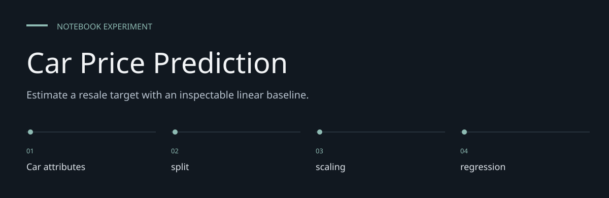

# Car Price Prediction

**Estimate a resale target with an inspectable linear baseline.**

> A recorded tabular regression experiment, with its data and reproduction limits stated.

[Task_3.ipynb](Task_3.ipynb) estimates `Selling_Price` from vehicle attributes using label encoding,
standardization and linear regression. It includes data inspection, a train/test split,
evaluation and one example prediction. This repository is a notebook, not a deployed pricing API.


[Architecture](docs/ARCHITECTURE.md) · [Evaluation guide](docs/EVALUATION.md)

**Contents:** [The challenge](#the-challenge) · [Walkthrough](#walk-through-the-project) ·
[Implementation](#implementation-state) · [Design choices](#engineering-choices) ·
[Next evidence](#next-evidence-to-collect)

---

## The challenge

Car resale records provide an approachable way to inspect the relationship between inputs and
Selling_Price. This repository keeps that work in a notebook so preparation, computation and saved
outputs can be read together. Its value is an inspectable experiment, not a deployed prediction
service.

## System at a glance


## Walk through the project

### 1. Supply the input data

The required CSV files are not tracked. Obtain an authorized copy with the expected schema and
replace the author-specific absolute paths before execution.

### 2. Inspect the preparation

Full-dataset label encoding precedes the split. Review the transformations and exclusions before
rerunning; an output cannot be understood separately from its input preparation.

### 3. Run the experiment

The implemented method is LinearRegression. StandardScaler is fitted on training features. Execute
in a fresh kernel to reveal ordering and dependency problems.

### 4. Read the diagnostics

A historical saved result reports R² 0.846454 and mean squared error 3.537020. The price units are
not established by the notebook. The sample prediction is not a production valuation or a
unit-verified market quote.

## Inspect and reproduce

Open the notebook on GitHub to read the saved outputs. To execute locally, use Python and Jupyter:

```sh
python3 -m venv .venv
.venv/bin/python -m pip install jupyterlab pandas numpy matplotlib seaborn scikit-learn
.venv/bin/python -m jupyter lab Task_3.ipynb
```

The input CSV is **not included**. Obtain the matching `car data 2.csv`, replace `file_path` in
the notebook with its location, then restart the kernel and run the cells in order. The checked-in
path points to a previous author's machine and cannot work unchanged on another computer.
Dependencies are not pinned; this installation command supplies the imported packages rather than
a reproduced historical environment.

## Data and workflow

| Role | Columns / operation |
|---|---|
| Target | `Selling_Price` |
| Numeric inputs | `Year`, `Present_Price`, `Driven_kms`, `Owner` |
| Encoded inputs | `Car_Name`, `Fuel_Type`, `Selling_type`, `Transmission` |
| Missing values | Median for kilometres; mode for fuel type |
| Split | 80% train / 20% test, `random_state=42` |
| Model | StandardScaler fitted on training inputs, then LinearRegression |
| Outputs | MSE, R² and one sample price prediction |

The saved evaluation reports **MSE 3.5370204238** and **R² 0.8464540624**. These are historical
notebook outputs inspected on 7 October 2026; the experiment was not rerun because the CSV is
absent.
The recorded sample predicts about 5.5418 in the dataset's price units. Currency/unit definitions
are not supplied in this repository, so that value should not be presented as a market quotation.

## Interpretation and limitations

Label encoding treats categories as numeric values for this model. Encoders are fitted before the
split; the notebook does not establish performance on unseen categories or independent market data.
There is one saved split, no cross-validation report, no automated tests, no dependency lockfile
and no serialized trained model. Dataset provenance and licence must be established separately.

The notebook is useful for inspecting a complete regression exercise. Reproducing its numbers
requires the same data and compatible versions; a saved output is not a fresh verification.

## Engineering choices

**Inputs are explicit.** Car_Name, Year, Present_Price, Driven_kms, Fuel_Type, Selling_type,
Transmission, Owner.

**Method is inspectable.** LinearRegression is the implemented method; no broader modeling
capability is inferred.

**Historical evidence is labeled.** A historical saved result reports R² 0.846454 and mean squared
error 3.537020. The price units are not established by the notebook.

## Implementation state

| State | Current evidence |
| --- | --- |
| Present | Notebook source and historical saved outputs |
| Required externally | Authorized CSV input and compatible Python packages |
| Not rerun | Data-dependent execution in this documentation pass |
| Not supplied | Deployment service, model registry or automated behavior suite |

The [architecture guide](docs/ARCHITECTURE.md) maps these statements to source entry points.
The [evaluation guide](docs/EVALUATION.md) separates inspection, executable checks and
domain validation, with the next evidence needed for each project.

## Next evidence to collect

- Supply data provenance and a reproducible local path.
- Record a fresh-kernel run with package versions.
- Evaluate stability across independent samples before widening any performance claim.
